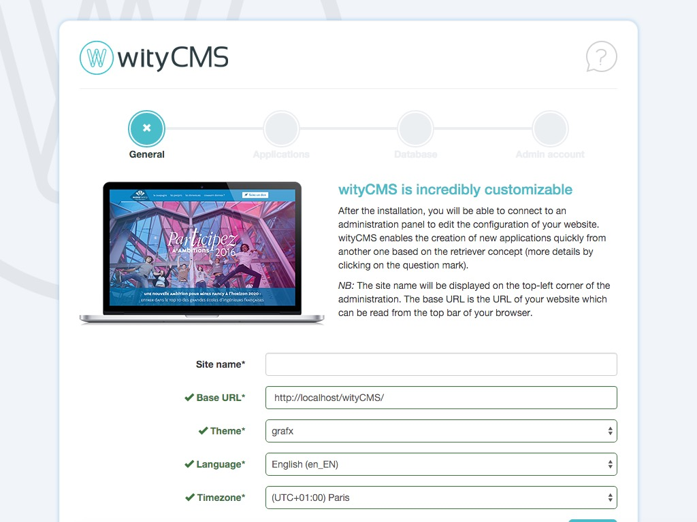

# wityCMS

## General

wityCMS is a lightweight Content Management System (CMS) in PHP, Model-View-Controller oriented.

This CMS uses its own templating system, named [WTemplate](https://github.com/Creatiwity/WTemplate), developed as [a separate GitHub project](https://github.com/Creatiwity/WTemplate) but included here as a submodule.

## Installation

### Prerequisites

* An **Apache server** with PHP 5.3+ or PHP7, *mod_rewrite* enabled and .htaccess files allowed;
* A **SQL server**, like *MySQL* or *MariaDB*, with a database available;
* A **FTP client**, like [FileZilla](https://filezilla-project.org/), to upload the files;
* Download the latest version of **wityCMS**: [zip](https://github.com/Creatiwity/wityCMS/releases/download/0.6.2/wityCMS-0.6.2.zip).

### Let's go

1. **Unzip** and **copy** wityCMS files on your web server using FileZilla.
2. Open a navigator and **go to the URL** of your web server.
3. Here, the **installation page** should be asking you information about your server, and your admin account. Fill in all the required fields until all the tabs are marked as valid.
4. **Click** on "Launch install".
5. **Congratulations!** wityCMS have just generated its configuration files (in `system/config`), created all its tables in the database and inserted the first user (you!) as an administrator. The system is ready to be used.

## FAQ

**Q: I just installed my wityCMS website, why is the index working but not the admin, nor the other pages?**

If you encounter page loading issues, please check that the file [.htaccess](.htaccess) is present at the root directory of your website.
